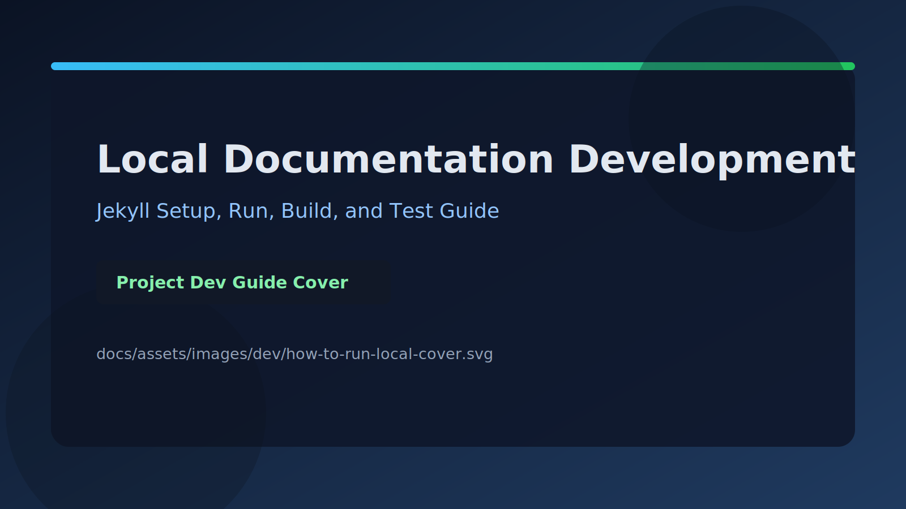

# Local Documentation Development Guide



This project documentation website is built with Jekyll and is designed to be deployed as a static site.

The repository is configured to build docs from the `docs/` directory (see `source: docs` in `_config.yml`).

## 1. Requirements

Based on Jekyll official installation docs, make sure the following are available:

- Ruby 2.7+ (`ruby -v`)
- RubyGems (`gem -v`)
- GCC / G++ and Make (`gcc -v`, `g++ -v`, `make -v`)

If Ruby is not installed yet, follow the OS-specific Jekyll install guide:

- https://jekyllrb.com/docs/installation/

## 2. Project Setup

From the project root, install dependencies from `Gemfile`:

```bash
bundle install
```

Note:

- Do not use global Jekyll commands for this project.
- Always run Jekyll through Bundler (`bundle exec ...`) to use the pinned project versions.

## 3. Run the Site Locally (Development)

Start local server with auto-rebuild:

```bash
bundle exec jekyll serve
```

Default local address:

- http://127.0.0.1:4000

Useful options:

```bash
bundle exec jekyll serve --livereload
bundle exec jekyll serve --host 127.0.0.1 --port 4001
```

## 4. Build the Static Output (Validation)

Generate production-like static output into `_site/`:

```bash
bundle exec jekyll build
```

Use this command before committing doc changes to ensure the site renders correctly.

## 5. Documentation Structure in This Project

Main content locations:

- `docs/_posts/` for blog posts (`YYYY-MM-DD-title.md`)
- `docs/_pages/` for static pages (Home, About Us, Contact Us, Sponsors, Resources, Blogs)
- `docs/assets/` for static assets (images, covers, styles)
- `docs/_dev/` for internal developer documentation

## 6. Common Content Workflows

### Add a new blog post

1. Create a file in `docs/_posts/` using Jekyll naming convention.
2. Add front matter (`layout`, `title`, `date`, `categories`).
3. Optionally add `cover_image` and render it in the post body.
4. Run `bundle exec jekyll build`.

### Add a new static page

1. Create a page in `docs/_pages/`.
2. Add front matter with `title` and `permalink`.
3. If needed in top navigation, add it to `header_pages` in `_config.yml`.
4. Run `bundle exec jekyll build`.

## 7. Testing Checklist for Docs and Site

Before pushing documentation updates:

1. Run `bundle exec jekyll build`.
2. Run `bundle exec jekyll serve` and manually check key routes:
	- `/`
	- `/about-us/`
	- `/contact-us/`
	- `/sponsors/`
	- `/resources/`
	- `/blogs/`
3. Open at least one blog post page and confirm cover image links are valid.
4. Check browser console for missing assets.

## 8. Troubleshooting

### `undefined method 'untaint'` or Liquid compatibility error

Update Liquid dependency in this project and rebuild:

```bash
bundle update liquid
bundle exec jekyll build
```

### Post skipped because of future date

If Jekyll reports a post as future-dated, set its `date` in front matter to current/past time, or enable future posts temporarily:

```bash
bundle exec jekyll serve --future
```

## 9. References

- Jekyll Installation: https://jekyllrb.com/docs/installation/
- Jekyll Step-by-Step Setup: https://jekyllrb.com/docs/step-by-step/01-setup/


